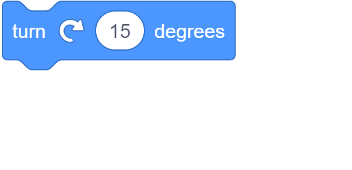
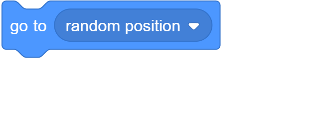
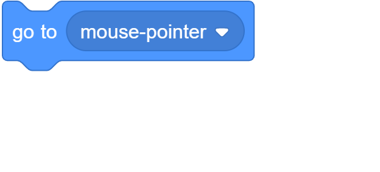
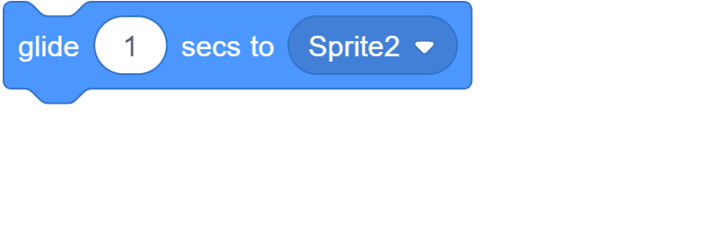

### Converting Scratch blocks to Python S.To.P code

<br>


```py
sprite.move_steps(10)

```

<br>



```py
sprite.turn_right_degrees(15)
```

<br>


```py
sprite.turn_left_degrees(15)
```

<br>





```py
sprite.go_to('random_position')
sprite.go_to('mouse_pointer')
```
