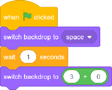
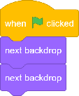
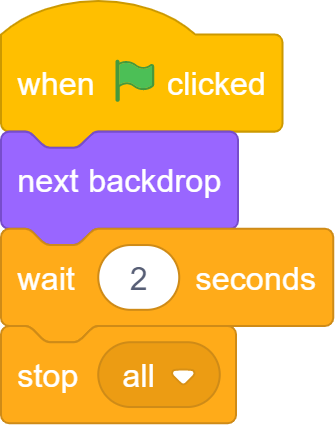
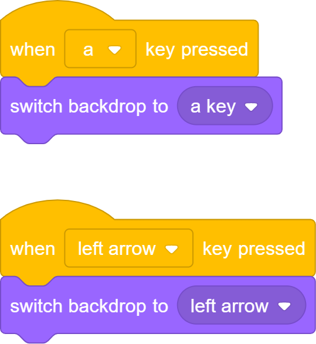
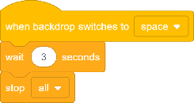
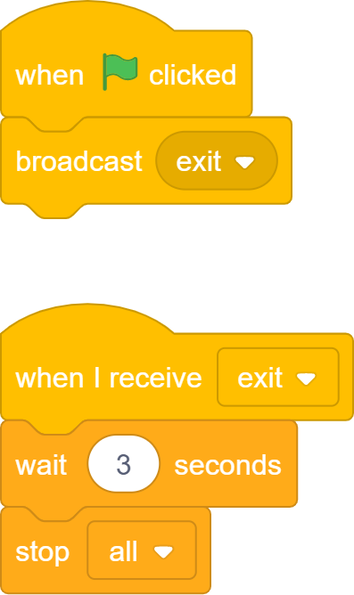
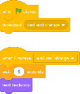
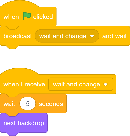

### Introduction to the `Project` object

The `Project` object is the first thing you make when creating a S.To.P project. It is the central 'hub' for everything related to the current project, including executing code and storing information. You can think of it as the screen, with all of the sprites being inside it.

<br>

## Methods

<br>

### Create a `Project`

```python
import stop
# create a project with 60 fps
project = stop.Project(fps=60)
```
**Arguments:**
- (optional) `fps=30`
  - Decides the frame rate of the project, defaults to 30

---

### `Project.run()`

**Description:**
This starts the project window and starts to execute your code. Without this, nothing will happen. After the window has been closed, any code afterwards will then be run.

```python
import stop

# creates the project
project = stop.Project()

# ..code goes here..

# starts the project
project.run()
```

---

### `Project.stop()` 

**Description:**
Stops the entire project and closes the window. All code after `project.run()` will then be run.


```python
import stop

project = stop.Project()

# creates a script
def stop_the_project():
    # stops the project
    project.stop()

# makes the script above run on the green flag
project.green_flag(stop_the_project)
project.run()
```

---

### `Project.wait()` 

**Description:**
Pauses the current script for a number of seconds, or for one frame.


```python
import stop

project = stop.Project()

# creates a script
def wait_one_second_then_stop():
    # waits 1 second
    project.wait(1)
    # stops the project
    project.stop()

# makes the script above run on the green flag
project.green_flag(wait_one_second_then_stop)
project.run()
```
**Arguments:**
- (optional) `seconds`
  - How many seconds to wait. If left blank it will wait 1 frame

---

### `Project.switch_backdrop_to()` 

**Description:**
Changes the backdrop to a given image



```python
import stop

project = stop.Project()

# creates a script
def change_the_backdrop():
    # changes backdrop to 'space'
    project.switch_backdrop_to('space')
    # waits 2 seconds
    project.wait(2)
    # changes to the 3rd backdrop
    project.switch_backdrop_to(3)

# makes the script above run on the green flag
project.green_flag(change_the_backdrop)
project.run()
```
**Arguments:**
- (required) `backdrop`
  - The name or number of the backdrop to switch to


---

### `Project.next_backdrop()` 

**Description:**
Changes to the next backdrop



```python
import stop

project = stop.Project()

# creates a script
def next_two_backdrops():
  # moves to the next two backdrops
  project.next_backdrop()
  project.next_backdrop()

# makes the script above run on the green flag
project.green_flag(next_two_backdrops)
project.run()
```

---

### `Project.green_flag()` 

**Description:**
Adds a function (or 'script') to the 'green flag' event. This means it will run when the project starts.



```python
import stop

project = stop.Project()

# creates a script
def run_when_project_starts():
  # change to the next backdrop
  project.next_backdrop()
  # wait 2 seconds
  project.wait(2)
  # stops the project
  project.stop()

# makes the script above run on the green flag
project.green_flag(run_when_project_starts)
project.run()
```
**Arguments:**
- (required) `function`
  - The function to run when the project starts

---

### `Project.key_pressed()` 

**Description:**
Adds a function (or 'script') to the 'key pressed' event. This means it will run when the chosen key is pressed.



```python
import stop

project = stop.Project()

# creates a script
def when_a_key_pressed():
  # change to the 'a' backdrop
  project.switch_backdrop_to('a key')

# creates a script
def when_left_arrow_pressed():
    # change to the 'a' backdrop
    project.switch_backdrop_to('left arrow')

# makes the scripts above run when their keys are pressed
project.key_pressed(when_a_key_pressed, 'a')
project.key_pressed(when_left_arrow_pressed, 'left_arrow')
project.run()
```
**Arguments:**
- (required) `function`
  - The function to run when the key is pressed
- (required) `key`
  - The key to press, which can be:
    - Letters `a` to `z`
    - Numbers `0` to `9`
    - `'space'`
    - `'up_arrow'`, `'down_arrow'`, `'left_arrow'`, `'right_arrow'`

---

### `Project.sprite_clicked()` 

**Description:**
Adds a function (or 'script') to the 'sprite clicked' event. This means it will run when the chosen sprite is clicked on.


```python
import stop

project = stop.Project()
# creates a sprite in the project
sprite = stop.Sprite(project)

# creates a script
def the_sprite_has_been_clicked():
    # change to the 'a' backdrop
    project.switch_backdrop_to('clicked')


# makes the script above run when the sprite is clicked
project.sprite_clicked(the_sprite_has_been_clicked, sprite)
project.run()
```
**Arguments:**
- (required) `function`
    - The function to run when the sprite is clicked
- (required) `sprite`
    - The sprite to click

---

### `Project.backdrop_switched_to()` 

**Description:**
Adds a function (or 'script') to the 'backdrop switched' event. This means it will run when the backdrop switches to the one you choose.



```python
import stop

project = stop.Project()

# creates a script
def backdrop_has_been_switched_to():
    # wait 3 seconds
    project.wait(3)
    # stop the project
    project.stop()


# makes the script above run when the backdrop switches to 'space'
project.backdrop_switched_to(backdrop_has_been_switched_to, 'space')
project.run()
```
**Arguments:**
- (required) `function`
  - The function to run when the backdrop switches
- (required) `backdrop`
  - The backdrop name or number to switch to

---

### `Project.broadcast_received()` 

**Description:**
Adds a function (or 'script') to the broadcast message event you choose. This means it will run when you broadcast that message.



```python
import stop

project = stop.Project()

# creates a script
def on_green_flag():
    project.send_broadcast('exit')

# creates a script
def receive_exit_broadcast():
    # wait 3 seconds
    project.wait(3)
    # stop the project
    project.stop()

# makes 'on_green_flag' run when the project starts
project.green_flag(on_green_flag)
# makes 'receive_exit_broadcast' run when the 'exit' message is broadcasted
project.broadcast_received(receive_exit_broadcast, 'exit')
project.run()
```
**Arguments:**
- (required) `function`
  - The function to run when the message is received
- (required) `message`
  - The message to receive

---

### `Project.send_broadcast()` 

**Description:**
Broadcasts a message for others to receive.



```python
import stop

project = stop.Project()

# creates a script
def on_green_flag():
    project.send_broadcast('wait and change')

# creates a script
def wait_and_change_backdrop():
    # wait 5 seconds
    project.wait(5)
    # move to next backdrop
    project.next_backdrop()

# makes 'on_green_flag' run when the project starts
project.green_flag(on_green_flag)
# makes 'wait_and_change_backdrop' run when the 'wait and change' message is broadcasted
project.broadcast_received(wait_and_change_backdrop, 'wait and change')
project.run()
```
**Arguments:**
- (required) `message`
  - The message to broadcast

---

### `Project.send_broadcast_and_wait()` 

**Description:**
Broadcasts a message for others to receive, and waits until all other scripts from it have finished.



```python
import stop

project = stop.Project()

# creates a script
def on_green_flag():
    project.send_broadcast_and_wait('wait and change')

# creates a script
def wait_and_change_backdrop():
    # wait 5 seconds
    project.wait(5)
    # move to next backdrop
    project.next_backdrop()

# makes 'on_green_flag' run when the project starts
project.green_flag(on_green_flag)
# makes 'wait_and_change_backdrop' run when the 'wait and change' message is broadcasted
project.broadcast_received(wait_and_change_backdrop, 'wait and change')
project.run()
```
**Arguments:**
- (required) `message`
  - The message to broadcast

---

### `Project.send_broadcast_and_wait()` 

**Description:**
Broadcasts a message for others to receive, and waits until all other scripts from it have finished.


```python
import stop

project = stop.Project()

# creates a script
def on_green_flag():
    project.send_broadcast_and_wait('wait and change')

# creates a script
def wait_and_change_backdrop():
    # wait 5 seconds
    project.wait(5)
    # move to next backdrop
    project.next_backdrop()

# makes 'on_green_flag' run when the project starts
project.green_flag(on_green_flag)
# makes 'wait_and_change_backdrop' run when the 'wait and change' message is broadcasted
project.broadcast_received(wait_and_change_backdrop, 'wait and change')
project.run()
```
**Arguments:**
- (required) `message`
  - The message to broadcast
